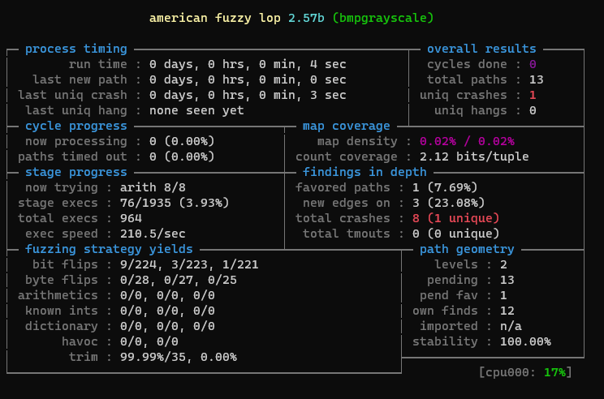
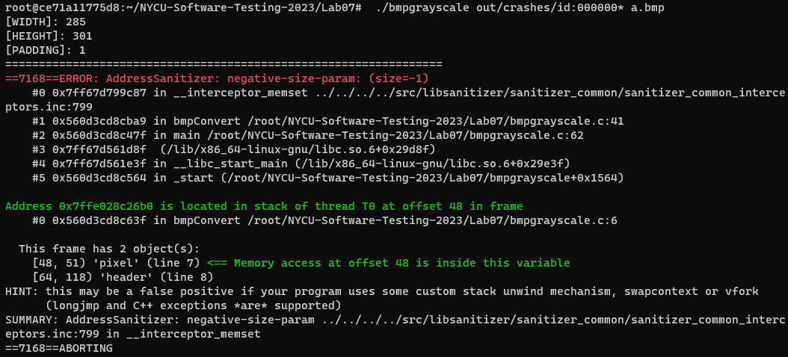

# Lab 7 - Fuzz Testing


## Environment setup

### AFL
```
$ git clone https://github.com/google/AFL.git
$ cd AFL
$ make
$ sudo make install
```

## Build & fuzz with AFL
```
$ cd Lab07
$ export CC=~/AFL/afl-gcc
$ export AFL_USE_ASAN=1
$ make
$ mkdir in
$ cp test.bmp in/
$ ~/AFL/afl-fuzz -i in -o out -m none -- ./bmpgrayscale @@ a.bmp
```
* Result

* Detail Report
    ```
    ./bmpgrayscale out/crashes/id:000000* a.bmp
    ```
      
